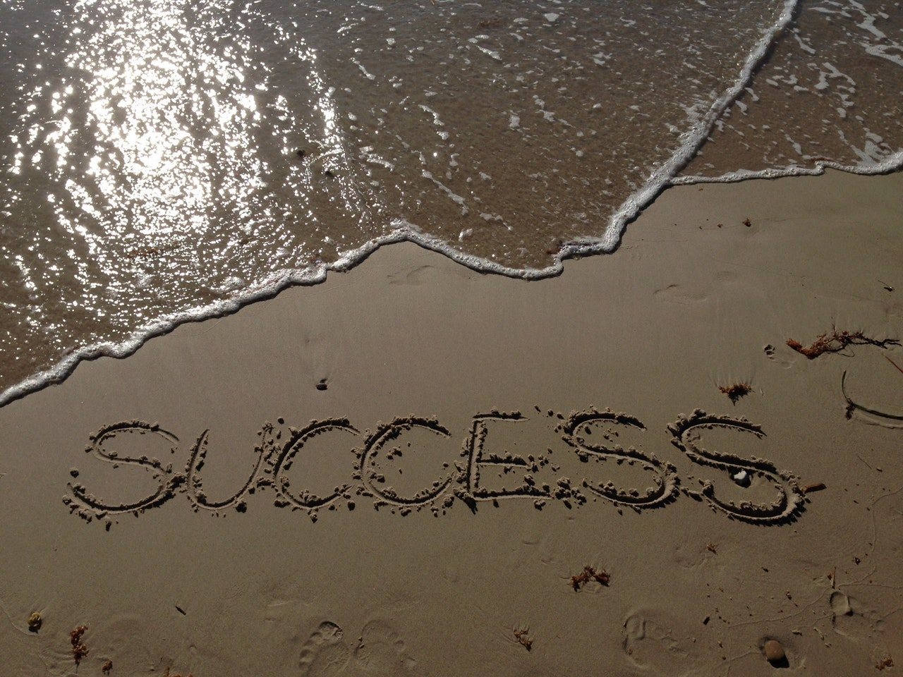

[Imposter Syndrome](https://davidwalsh.name/impostor-syndrome). David Walsh's article about it really summed up many feelings I share. When I started on my quest to overhaul this site, I wanted to use something cutting edge. I have used Wordpress for almost a decade. It does the job. Some of the recent improvements have been welcomed. Yet it felt comfortable which was what I was trying to break away from. So I opted to experiment. That lead me to feeling like I was posing as a web developer despite my long history in the industry. I really did feel like an imposter.

So I put this site up in comfortable territory, using Wordpress. But I am not thrilled with it. I needed to get something up. After I launched it, I sought out to do the major project I initially conceived. I've been working to understand and use [Gatsby.JS](https://www.gatsbyjs.org) to power this site. I've been a fan of React for a long while. I messed with Angular. I looked at Vue. I sat on the fence for a long time afraid to pick one stack and really go down the rabbit hole. I've been doing that with React.

Yet the starter projects Gatsby references on its site seemed too complex, too opinionated, or too simple. I didn't find a real good solution for what I was looking to accomplish. So I tried. Currently I have iteration 7 running on my laptop where I started with a very barebones install of Gatsby. I'm adding what I feel I'll need while finding a whole mess of plugins and tools that show how little I have heard of even with the many newsletters and Twitter accounts I follow. Tools with thousands of stars on Github. It truly is a rabbit hole.

The message I'm getting to is this: don't be afraid to experiment. Don't be afraid to abandon something if it doesn't feel right for the job. I'm going to continue trying to understand how to get what I want out of this new platform and eventually this site will be built with it. How long that takes is really up to me.