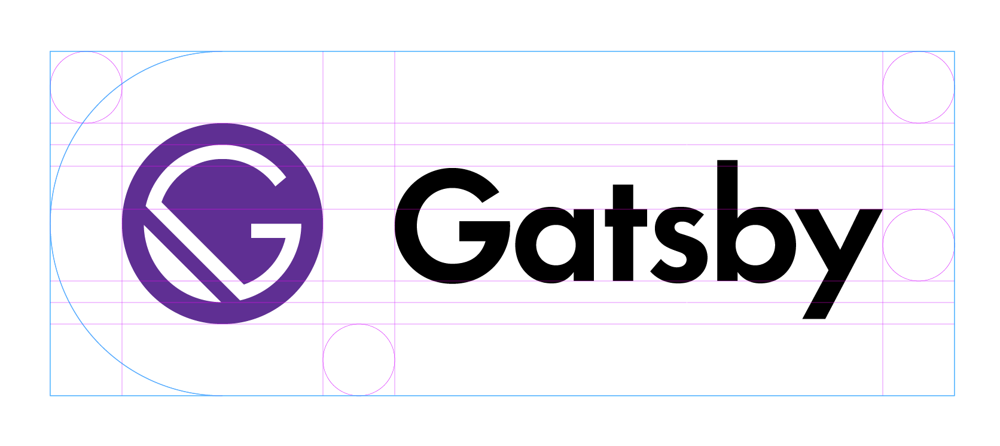

About 2 months ago, I started giving a damn about overhauling my website. Last month I did it while sticking with the platform I know: WordPress. All the while I was experimenting behind the scenes with [Gatsby.JS](http://www.gatsbyjs.org) trying to find a way to make it work the way I wanted. I learned a lot and had frustrating fun with it. The SSR (server side rendering), HMR (hot module reloading), and quickness of it were things I have appreciated playing with. 

So now the site is mostly where I need it as far as being a platform for this site. I'll continue hammering away and improving the functionality to better serve my desires but I'm finally getting there.