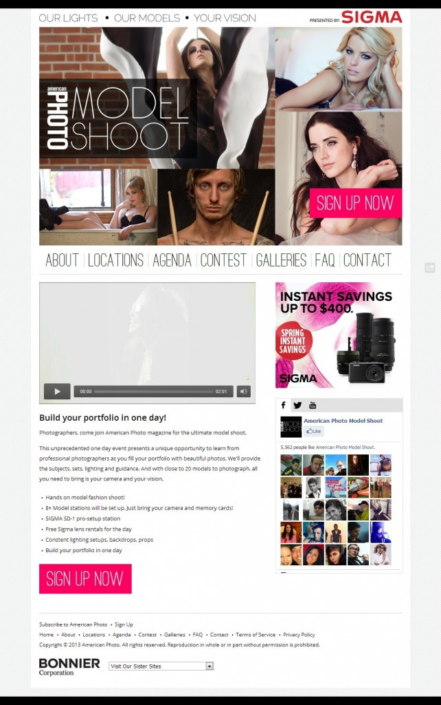

American Photo Magazine hosts annual photo sessions for aspiring photographers to gain experience while working with different models, expanding their portfolios. In preparation for the 2013 session, our team was asked to build the new sub site. The developer and I received the mockups from the designer and took off from there. The site uses Google Web Fonts to minimize the usage of images so the photos would be able to stand out.