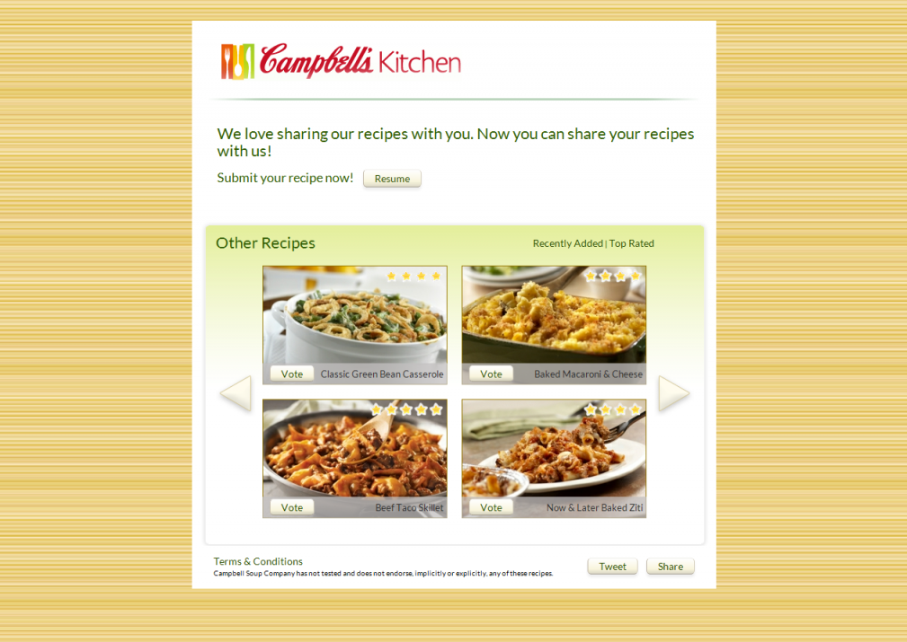

In a bid to utilize crowdsourcing to increase its recipe catalog, soup makers Cambell’s wanted a Facebook page that allowed users to upload their own recipes using Campbell’s products. Users then got the opportunity to vote for their favorite recipes. The users recipes pop up in lightboxes so there is minimal refreshing of the page while keeping lightness the company was looking for in the site.