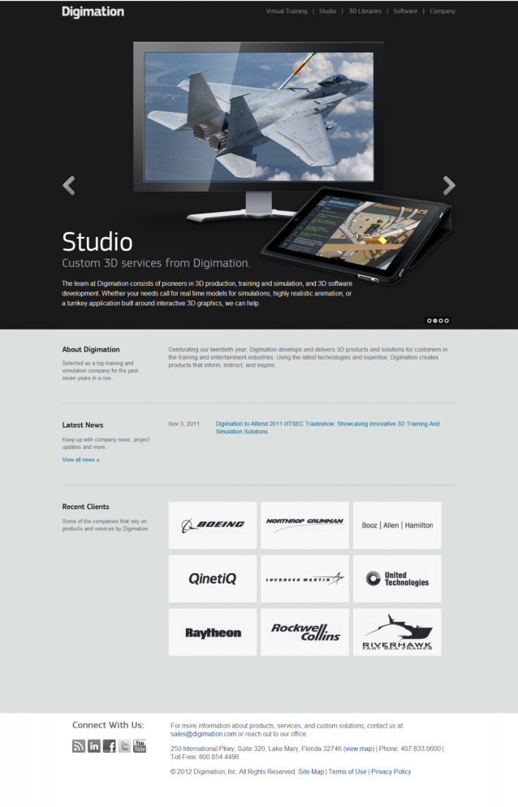

As a 3D modeling provider, Digimation offers a unique product that is used worldwide. Their existing web site did not showcase their graphics well so they redesigned their site internally. They contacted out the development of it into a functional web site. They asked for it to be WordPress based and to use their chosen shopping cart solution, CRE Reloaded. Building out the site forced me to rethink several things as their requests were larger than the simple templating WordPress utilizes. We had to integrate multiple carousel galleries throughout the site and make the site effective to the users. The result is a great looking web site that showcases their products beautifully.