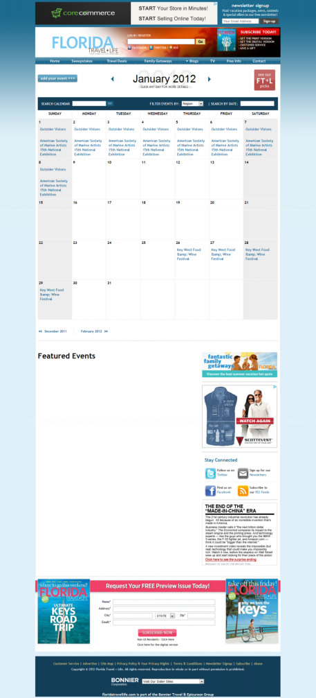

One of the first challenging projects I worked on at Bonnier was an events calendar for Florida Travel & Life magazine. The brand wanted to allow for different resources to post upcoming events and increase their visibility. Another brand had recently done something similar so most of the code was ported over to the FTL web site. We then took this foundation and modified it to fit the requests for this brand. In the end, we were able to accomplish the projects goal and the calendar is still up and being utilized over 2 years later.