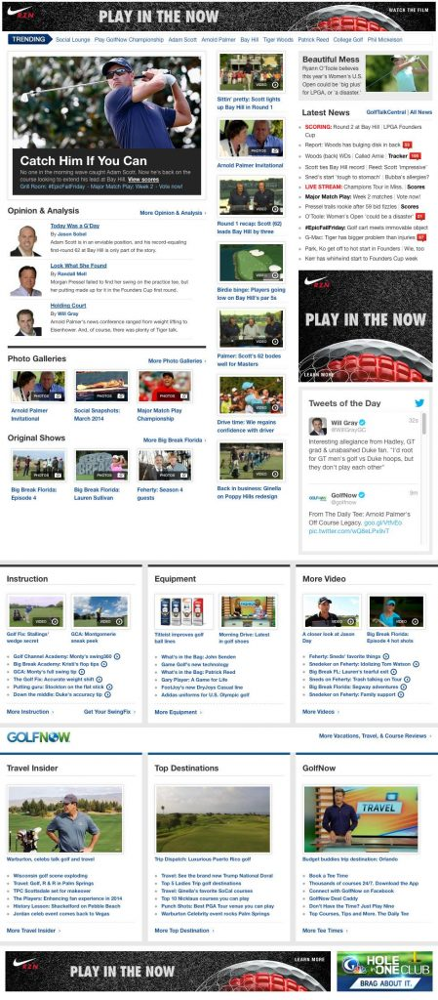

Retrofitted GolfChannel.com’s existing design into a mobile friendly Drupal 7 theme. I was given complete control to make design edits in order for the site to abandon using an m.dot domain. The new codebase was half the size and created a more usable product for users.