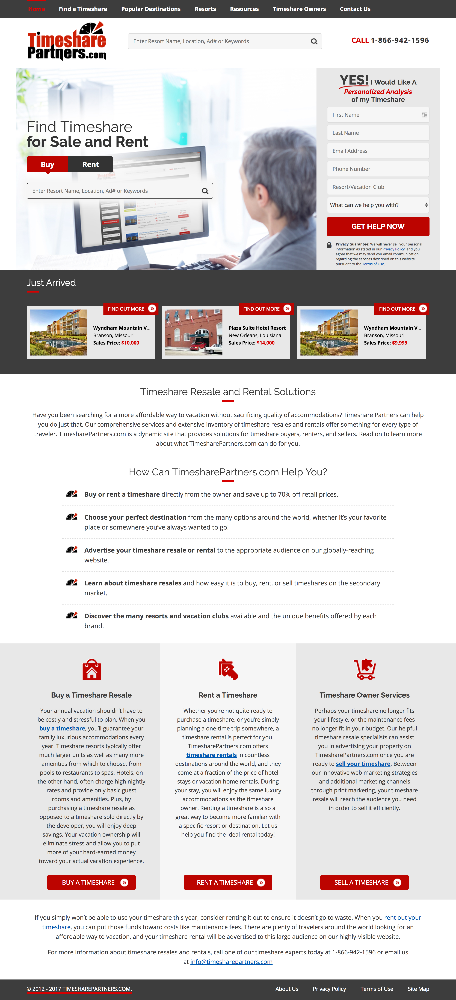

In mid 2016, the marketing team wanted to overhaul the site to be responsive due to an increase in mobile users. When the initial designs overlooked mobile friendly features, I worked with the team to touch up the new design to render more effectively on smaller device screens while still focusing on converting users into customers.