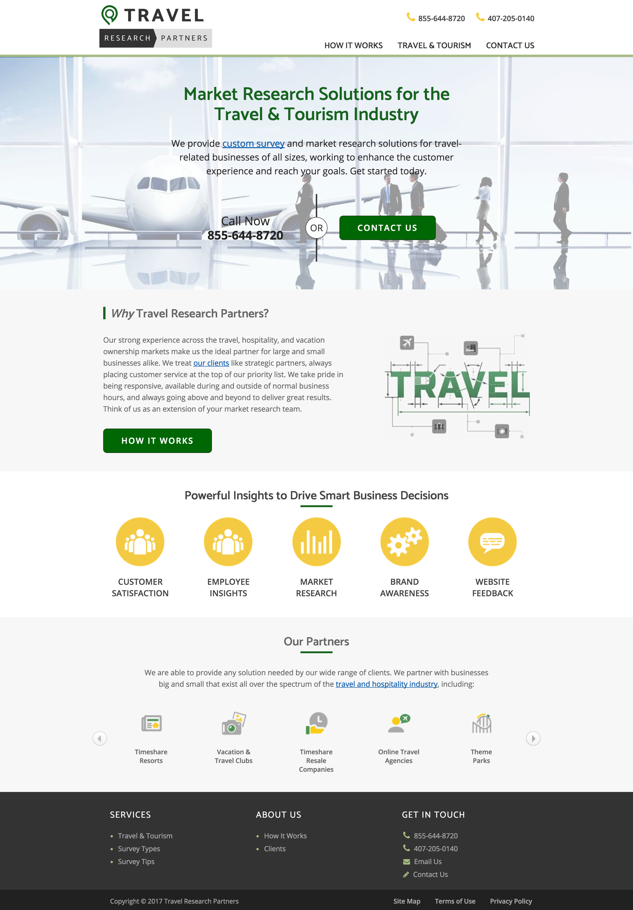

My employer wasn't afraid to try and spin up a new business. The original designs for this site needed adjustments based on feedback I provided. I used a boilerplate I built to speedup development and turn the project around in record time. I utilized the new Picture spec to control the art direction of hero images and flexbox for clean code. The site acheives a 90/100 on mobile in Google's PageSpeed Insights.
