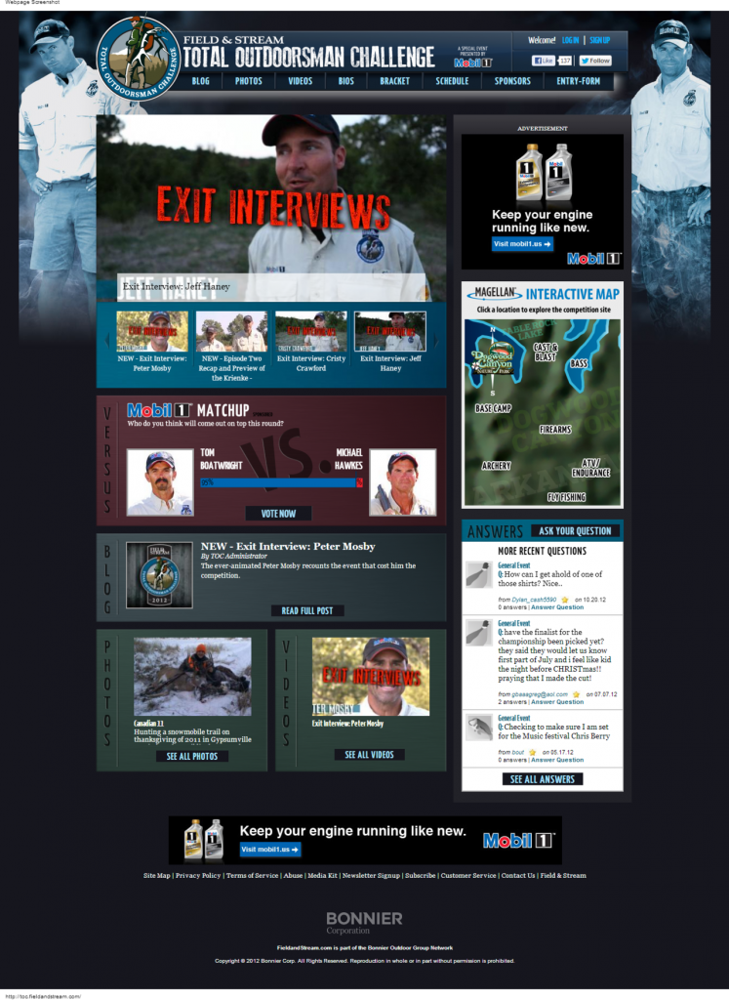

Field & Stream Magazine partnered with the Outdoor Channel to host a reality based competition for outdoorsmanship. We were asked to modernize the site in anticipation of the new 2012 season. The design team sent over the initial PSDs, and after some push and pull, we had a more web friendly design ready to develop. Use of web fonts in place of text based images was managed for the navigation. A background rotation script was written to randomize the selection of the 100+ possible images.