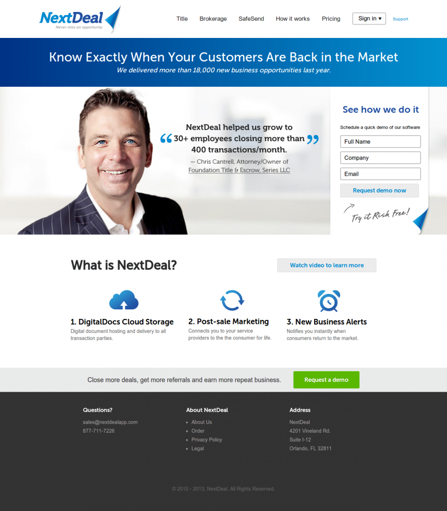

I was approached with completed PSDs and asked to develop them into a functional WordPress web site. The site, while not intended to be mobile friendly, was built using REM units with PX fallbacks. It is fully cross-browser consistent and utilizes built-in features of WordPress menus and templating from custom developed parent theme.