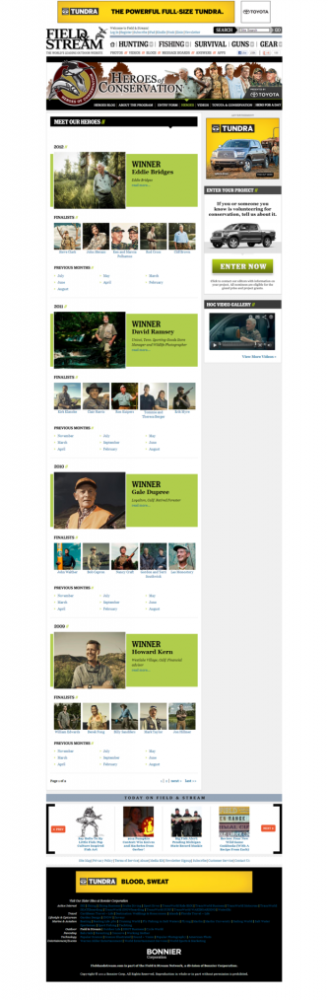

We were asked to refresh the Heroes of Conservation awards site for 2012. The site needed an updated header and some elements to be cleaned up. We were able to quickly turn around a modernized look that brought improved visibility to this worthy award.