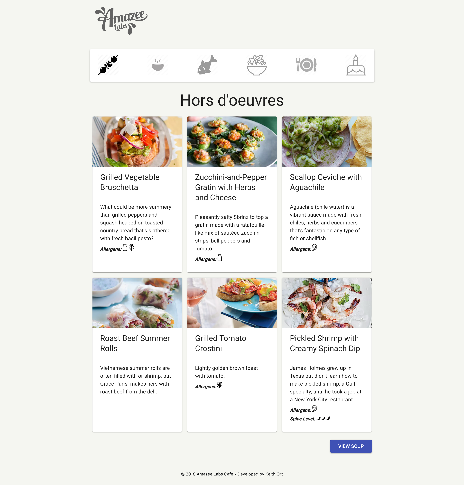

I am working more and more with the React JavaScript library. This project is using React's native functionality to handle state management without needing Redux or Flux. The design utilizes Google's Material Design ported to React. 

You can view the application on [Surge](https://brainy-steel.surge.sh/) and the source code at [GitHub](https://github.com/keithort/RestaurantMenu). 